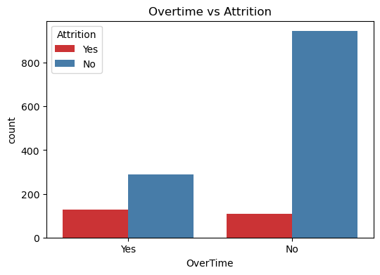
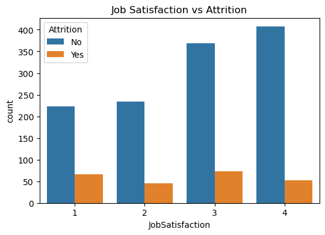
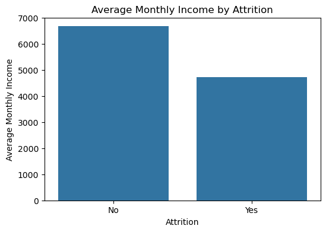
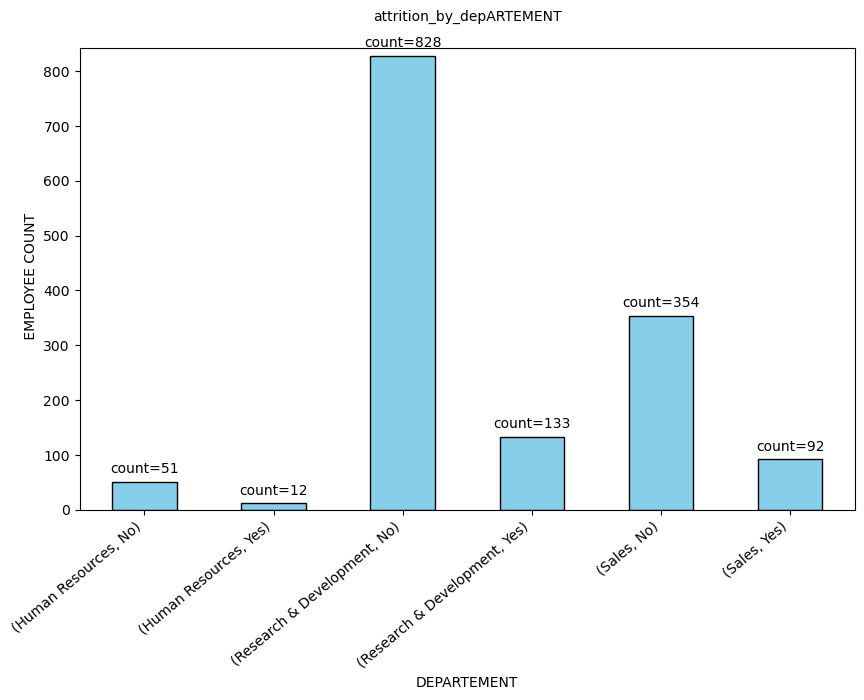
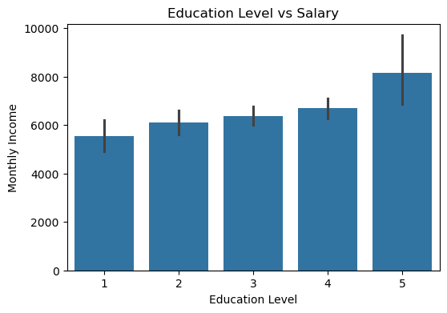
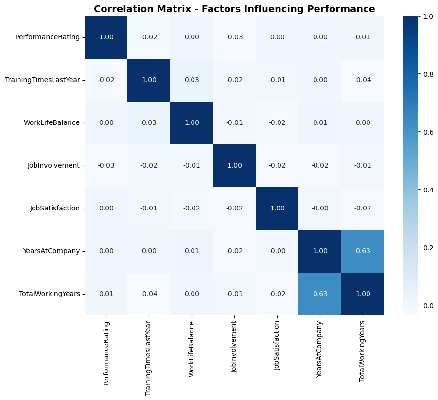

# 📊 Majorel HR Attrition Analysis

### An end-to-end data analytics project uncovering the true drivers of employee turnover


> *"Attrition is rarely sudden. It is the cumulative result of unaddressed signals — in workload, compensation equity, development opportunities, and workplace satisfaction."*

---

## 📌 Table of Contents

- [Project Overview](#-project-overview)
- [Dataset](#-dataset)
- [Key Findings](#-key-findings)
- [Visualizations](#-visualizations)
- [KPI Dashboard](#-kpi-dashboard)
- [Methodology](#-methodology)
- [Tech Stack](#-tech-stack)
- [Project Structure](#-project-structure)
- [How to Run](#-how-to-run)
- [Strategic Takeaway](#-strategic-takeaway)

---

## 🔍 Project Overview

Workforce attrition is one of the most expensive — and most preventable — challenges in HR today. This project delivers a comprehensive end-to-end HR attrition analysis on the Majorel employee dataset (1,470 records), applying rigorous data analytics to uncover the real drivers behind employee turnover.

The analysis covers:

- ✅ Data cleaning & preprocessing
- ✅ Outlier detection and handling (IQR Capping)
- ✅ Employee satisfaction & performance KPIs
- ✅ Compensation structure & gender pay gap analysis
- ✅ Multi-dimensional attrition driver identification
- ✅ Correlation analysis across workforce variables

---

## 📂 Dataset

| Property | Detail |
|---|---|
| **Source** | Majorel HR Dataset (`Majorel.csv`) |
| **Records** | 1,470 employees |
| **Original Features** | 35 columns |
| **Features After Cleaning** | 32 columns |
| **Target Variable** | `Attrition` (Yes / No) |
| **Overall Attrition Rate** | ~16.1% |

**Columns removed** during preprocessing — constant values with no analytical value:

`EmployeeCount` · `StandardHours` · `Over18`

---

## 💡 Key Findings

### 01 — Overtime is the Strongest Attrition Predictor ⏱️
Employees subject to chronic overtime demonstrated significantly higher turnover rates.
Sustainable workload management is not a wellness initiative — it is a retention strategy.

### 02 — Compensation Matters, But Is Not the Whole Story 💰
Employees who left earned a noticeably lower average monthly income ($4,787 vs $6,833).
However, salary alone does not explain attrition — it is one signal among many.

### 03 — Work-Life Balance & Engagement Drive Retention ⚖️
Job involvement, environment satisfaction, and work-life balance proved equally — if not more — influential than compensation in predicting whether an employee stays.

### 04 — Training Directly Impacts Performance 📚
A clear positive correlation was found between training frequency and performance ratings.
L&D is not a perk — it is a measurable retention and performance strategy.

### 05 — Attrition Is Not Uniform Across Departments 🏢
Sales and Research & Development recorded the highest turnover counts.
Blanket retention policies miss this entirely. Department-level strategies are essential.

### 06 — Salary Is Shaped by Structure, Not Tenure Alone 🎓
Job level (r=0.95), total working years (r=0.77), and education level emerged as the
primary determinants of monthly income — reinforcing the value of transparent compensation frameworks.

---

## 📊 Visualizations

### Overtime vs Attrition
Employees on overtime are disproportionately more likely to leave — nearly 30% attrition rate vs ~11% for non-overtime employees.



---

### Job Satisfaction vs Attrition
Employees with the lowest job satisfaction score (1) show the highest proportion of attrition relative to their group size.



---

### Average Monthly Income by Attrition
A ~$2,046 income gap exists between employees who stay ($6,833) and those who leave ($4,787).



---

### Attrition by Department
R&D has the highest absolute attrition count (133), while Sales has a disproportionately high attrition rate (92 out of 446 = ~20.6%).



---

### Education Level vs Monthly Salary
Higher education levels correlate with incrementally higher salaries, with the largest jump at Level 5 (advanced degree), though the effect is moderate compared to job level.




---

### Correlation Matrix — Factors Influencing Performance
Years at company and total working years show the strongest inter-correlation (0.63), while performance rating shows weak correlation with most behavioral factors individually.



---

## 📈 KPI Dashboard

### 😊 Employee Satisfaction KPIs

| KPI | Score | Scale |
|---|---|---|
| Average Job Satisfaction | **2.73** | 1 – 4 |
| Average Environment Satisfaction | **2.72** | 1 – 4 |
| Average Work-Life Balance | **2.76** | 1 – 4 |
| Employee Engagement Score (Job Involvement) | **2.72** | 1 – 4 |
| Relationship Satisfaction Index | **2.71** | 1 – 4 |

### ⭐ Performance KPIs

| KPI | Value |
|---|---|
| Average Performance Rating | ~3.15 / 4 |
| High Performance Rate (Rating ≥ 4) | ~15% |
| Best Performing Department | Research & Development |

### 💰 Compensation KPIs

| KPI | Value |
|---|---|
| Average Monthly Income | ~$6,503 |
| Average Salary Hike | ~15.2% |
| Gender Pay Gap | ~1.2% (Male slightly higher) |
| Highest Avg Salary by Dept | Research & Development |

---

## 🔬 Methodology

```
Raw Data (1,470 rows × 35 cols)
        │
        ▼
  Data Cleaning
  ├── Remove constant columns (EmployeeCount, StandardHours, Over18)
  ├── Verify: 0 missing values
  └── Verify: 0 duplicate rows
        │
        ▼
  Outlier Detection & Handling
  ├── IQR method applied across all numerical columns
  ├── MonthlyIncome identified as highest outlier column
  └── IQR Capping applied to MonthlyIncome
        │
        ▼
  Exploratory Data Analysis
  ├── Descriptive statistics (numerical + categorical)
  ├── Distribution analysis via boxplots
  └── Value counts for categorical columns
        │
        ▼
  KPI Development
  ├── Satisfaction KPIs (Job, Environment, Work-Life, Engagement, Relationship)
  ├── Performance KPIs (Rating avg, High Performers %, Dept breakdown)
  └── Compensation KPIs (Income, Salary Hike, Gender Pay Gap, Job Level Salary)
        │
        ▼
  Attrition Analysis
  ├── Overtime vs Attrition
  ├── Job Satisfaction vs Attrition
  ├── Monthly Income vs Attrition
  └── Department vs Attrition
        │
        ▼
  Performance & Salary Deep Dive
  ├── Correlation heatmaps (Performance factors + Salary factors)
  ├── Training Times vs Performance Rating
  ├── Work-Life Balance vs Performance Rating
  ├── Job Involvement vs Performance Rating
  ├── Experience (YearsAtCompany) vs Monthly Income by Job Level
  ├── Salary vs Job Satisfaction (scatter)
  └── Education Level vs Monthly Income
```

---

## 🛠 Tech Stack

| Library | Purpose |
|---|---|
| `pandas` | Data manipulation & analysis |
| `numpy` | Numerical computations |
| `matplotlib` | Static visualizations |
| `seaborn` | Statistical visualizations |
| `plotly` | Interactive visualizations |
| `jupyter` | Notebook environment |

---

## 📁 Project Structure

```
Majorel-HR-Attrition-Analysis/
│
├── 📓 Majorel_HR_Attrition_Analysis.ipynb
├── 📄 README.md
├── 📊 Majorel.csv
├── overtime.png
├── jobsat.png
├── income.png
├── dept.png
├── perf_heatmap.png
└── education.png

---

## ▶️ How to Run

**1. Clone the repository**
```bash
git clone https://github.com/your-username/majorel-hr-analysis.git
cd majorel-hr-analysis
```

**2. Install dependencies**
```bash
pip install pandas numpy matplotlib seaborn plotly jupyter
```

**3. Launch the notebook**
```bash
jupyter notebook Majorel_HR_Attrition_Analysis.ipynb
```

---

## 📌 Strategic Takeaway

Attrition is rarely sudden. The warning signs are always there — embedded in overtime records, salary structures, satisfaction scores, and department-level metrics. The organizations that win the talent game are not the ones that react to resignations. They are the ones that build systems to **see the signals before the exit interview**.

This analysis demonstrates that with the right data pipeline and exploratory framework, those signals become visible — and actionable.

---

*Built with Python & Jupyter Notebook — if you found this project useful, please consider giving it a ⭐*
